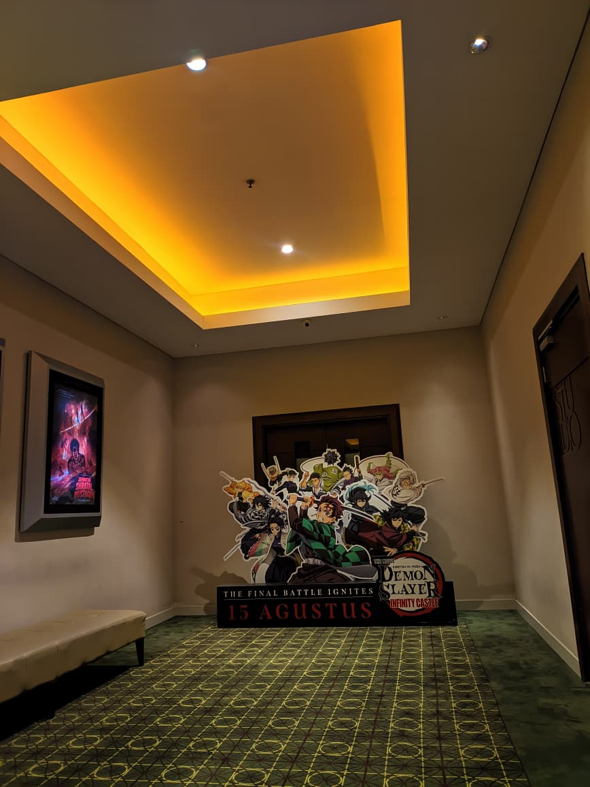

# 📸 Portfolio Gallery Website

Proyek ini adalah sebuah website portofolio sederhana yang dilengkapi dengan **navigasi dropdown**, **galeri foto interaktif**, serta **lightbox** untuk memperbesar foto.  
Website ini dibuat menggunakan **HTML** untuk struktur, **CSS** untuk desain/tampilan, dan **JavaScript** untuk memberikan interaktivitas.

Tujuan utama dari proyek ini adalah memberikan gambaran bagaimana cara membangun website statis yang sederhana namun tetap terlihat modern dan interaktif.

---

## 📂 Struktur File

```struktur
pertemuan4/
├── gallery.html # Halaman utama galeri
├── style.css # File CSS untuk mengatur tampilan
├── script.js # File JavaScript untuk logika lightbox
├── project.html # (opsional) Halaman pengalaman
├── about.html # (opsional) Halaman tentang saya
├── contact.html # (opsional) Halaman kontak
└── images/ # Folder berisi koleksi foto
```

---

## 📝 Analisis dan Penjelasan Kodingan

### 1. **File `gallery.html`**

File ini berfungsi sebagai halaman utama galeri. Di dalamnya terdapat tiga bagian utama: **header (navigasi), galeri foto, dan lightbox**.

#### a. Header dengan Dropdown Menu

```html
<header>
  <div class="logo">My Portfolio</div>
  <ul class="nav-links">
    <li class="dropdown">
      <a href="#">Beranda ▼</a>
      <ul class="dropdown-menu">
        <li><a href="project.html">Pengalaman</a></li>
        <li><a href="about.html">Tentang Saya</a></li>
        <li><a href="gallery.html">Gallery</a></li>
        <li><a href="contact.html">Kontak</a></li>
      </ul>
    </li>
  </ul>
</header>
```

Bagian ini membuat menu navigasi di atas halaman. Menu "Beranda" memiliki tanda ▼ yang artinya ada submenu. Saat pengguna mengarahkan kursor (hover), akan muncul pilihan tambahan seperti Pengalaman, Tentang Saya, Gallery, dan Kontak.

#### b. Bagian Gallery

```galeri
<section class="gallery">
  <h2>Galeri Foto</h2>
  <div class="gallery-container">
    <div class="gallery-item"></div>
    <div class="gallery-item"></div>
    <div class="gallery-item"></div>
  </div>
</section>
```

Di sini terdapat koleksi foto yang ditampilkan dalam bentuk grid (kotak-kotak sejajar).
Kelebihannya adalah tampilan tetap rapi walaupun ukuran layar berbeda (responsif).

#### c. Lightbox

```lightbox
<div id="lightbox" class="lightbox">
  <span class="close">&times;</span>
  <span class="prev">&#10094;</span>
  
  <span class="next">&#10095;</span>
</div>
```

Lightbox ini muncul ketika salah satu gambar di klik.

- Tombol × digunakan untuk menutup.
- Tombol panah ← dan → digunakan untuk melihat foto sebelumnya atau berikutnya.

### 2. **File `style.css`**

#### a. Body dan Background

```body&bg
body {
  font-family: Arial, sans-serif;
  background: linear-gradient(135deg, #007bff, #00d4ff);
  color: white;
  min-height: 100vh;
}
```

Bagian ini memberikan warna gradasi biru dari atas ke bawah agar website tidak terlihat polos.

#### b. Navbar dan Dropdown

```nav&dropdown
header {
  background: #222;
  padding: 10px 20px;
  display: flex;
  align-items: center;
  justify-content: space-between;
}

.dropdown-menu {
  display: none;
  position: absolute;
  background: #222;
  min-width: 180px;
}

.dropdown:hover .dropdown-menu {
  display: block;
}
```

Navbar diberi warna hitam (#222).
Submenu pada dropdown awalnya disembunyikan, tapi ketika pengguna hover pada menu utama, submenu akan tampil.

#### c. Gallery

```gallery
.gallery-container {
  display: grid;
  grid-template-columns: repeat(auto-fit, minmax(220px, 1fr));
  gap: 20px;
}

.gallery-item img {
  width: 100%;
  height: 200px;
  object-fit: cover;
  transition: transform 0.4s;
}

.gallery-item img:hover {
  transform: scale(1.1);
}
```

Foto ditampilkan dalam bentuk grid responsif.
Saat kursor diarahkan ke foto, fotonya sedikit membesar (efek zoom).

#### d. Lightbox

```lightbox
.lightbox {
  display: none;
  position: fixed;
  z-index: 999;
  width: 100%;
  height: 100%;
  background: rgba(0, 0, 0, 0.9);
  text-align: center;
}
```

Lightbox menutupi layar penuh dengan latar belakang hitam transparan.
Foto akan ditampilkan di tengah layar agar fokus pengguna hanya ke gambar tersebut.

### 2. **File `script.js`**

File ini berisi logika agar galeri bisa interaktif.

#### a. Membuka Lightbox

```lightbox
galleryItems.forEach((item, index) => {
  item.addEventListener("click", () => {
    lightbox.style.display = "block";
    lightboxImg.src = item.src;
    currentIndex = index;
  });
});
```

Saat pengguna klik gambar → lightbox ditampilkan.
Gambar yang dipilih akan muncul di dalam lightbox.

#### b. Menutup Lightbox

```lightbox
closeBtn.addEventListener("click", () => {
  lightbox.style.display = "none";
});
```

Tombol ❌ akan menutup lightbox.

#### c. Navigasi Gambar

```navgambar
nextBtn.addEventListener("click", () => {
  currentIndex = (currentIndex + 1) % galleryItems.length;
  lightboxImg.src = galleryItems[currentIndex].src;
});

prevBtn.addEventListener("click", () => {
  currentIndex = (currentIndex - 1 + galleryItems.length) % galleryItems.length;
  lightboxImg.src = galleryItems[currentIndex].src;
});
```

Tombol → menampilkan gambar berikutnya.
Tombol ← menampilkan gambar sebelumnya.

#### d. Menutup Saat Klik Luar Foto

```close
lightbox.addEventListener("click", (e) => {
  if (e.target === lightbox) {
    lightbox.style.display = "none";
  }
});
```

Kalau pengguna klik area hitam di luar gambar, lightbox otomatis tertutup.

#### 📌 Penambahan Dropdown Menu

Untuk menambahkan dropdown pada navigasi, digunakan kode berikut:

```dropdown
<nav>
  <ul class="nav-links">
    <li class="dropdown">
      <a href="#">Beranda ▼</a>
      <ul class="dropdown-menu">
        <li><a href="project.html">Pengalaman</a></li>
        <li><a href="about.html">Tentang Saya</a></li>
        <li><a href="gallery.html">Gallery</a></li>
        <li><a href="contact.html">Kontak</a></li>
      </ul>
    </li>
  </ul>
</nav>
```

    </ul>

  </li>
</ul>

ul.nav-links adalah daftar menu utama.
li.dropdown menandakan ada submenu.
.dropdown-menu akan muncul saat pengguna hover pada menu utama.
