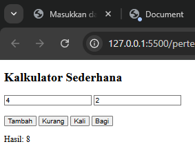

# Praktikum 5

Berikut adalah penjelasan analisis dari Praktikum 5 beserta hasil output nya :

---

## 📝 Analisis dan Penjelasan Kodingan

### 1. [`latihan1.html`](latihan1.html)

Kode Program :

```html
<!DOCTYPE html>
<html lang="en">
  <head>
    <meta charset="UTF-8" />
    <meta name="viewport" content="width=device-width, initial-scale=1.0" />
    <script language="JavaScript">
      document.write("Program JavaScript aku di kepala");
    </script>
    <title>Document</title>
  </head>
  <body>
    <script language="JavaScript">
      document.write("Program JavaSript Aku di body");
    </script>
  </body>
</html>
```

Output:


Analisis:

- Di bagian tag script pada bagian head dan body, ada attribute `language="javascript"` yang menandakan bahwa script dalam program memakai bahasa pemrograman JavaScript
- Di bagian tag head, ada tag script yang digunakan untuk menampilkan teks "Program JavaScript Aku di kepala" `document.write("Program JavaScript Aku di kepala")`
- Di bagian tag body, ada tag script yang digunakan untuk menampilkan teks "Program JavaScript Aku di body" `document.write("Program JavaScript Aku di body ")`

### 2. [`latihan2.html`](latihan2.html)

Kode Program :

```html
<!DOCTYPE html>
<html lang="en">
  <head>
    <meta charset="UTF-8" />
    <meta name="viewport" content="width=device-width, initial-scale=1.0" />
    <title>Belajar Javascript : Mengenal Event Pada Javascript</title>
  </head>
  <body>
    <h1>Mengenal Event Pada Javascript</h1>
    <h2>Perograman WEB Event one click</h2>
    <!-- memberikan event pada element tombol -->
    <button onclick="tampilkan_nama()">klik disini</button>

    <!-- id hasil -->
    <div id="hasil"></div>

    <script>
      // membuat function tampilkan_nama
      function tampilkan_nama() {
        document.getElementById("hasil").innerHTML =
          "<h3>Nama saya Ahmed Bin Atir Alakatir</h3>";
      }
    </script>
  </body>
</html>
```

Output:


Analisis

- `function tampilkan_nama()` → mendefinisikan sebuah fungsi yang akan dijalankan saat dipanggil.

- `document.getElementById("hasil")` → mencari elemen HTML dengan id="hasil".

- `.innerHTML` = `<h3>Nama saya Ahmed Bin Atir Alakatir</h3>`; → mengganti isi elemen tersebut dengan teks/HTML baru.

👉 Jadi, saat tombol diklik (karena ada `onclick="tampilkan_nama()"`), fungsi ini dijalankan dan teks Nama saya Ahmed Bin Atir Alakatir akan muncul di dalam `<div id="hasil"></div>`.

### 3. [`latihan3.html`](latihan3.html)

Kode Program :

```html
<body>
  <script language="JavaScript">
    document.write("Selamat Belajar Angkatan 2024", "<br>");
    document.write("JavaScript Pemrograman WEB Teknik Komputer");
  </script>
</body>
```

Output:


Analisis:

- `document.write("Selamat Belajar Angkatan 2024", "<br>");` → menulis teks "Selamat Belajar Angkatan 2024" di halaman web, diikuti dengan tag `<br>` untuk membuat baris baru.
- `document.write("JavaScript Pemrograman WEB Teknik Komputer");` → menulis teks "JavaScript Pemrograman WEB Teknik Komputer" di halaman web.

### 4. [`latihan4.html`](latihan4.html)

Kode Program :

```html
<body>
  <script language="JavaScript">
    var nama = prompt("Siapa nama ta' ?");
    document.write("Hai, " + nama);
  </script>
</body>
```

Output:


Analisis:

- `var nama = prompt("Siapa nama ta' ?");` → menampilkan dialog box yang meminta pengguna untuk memasukkan nama. Nilai yang dimasukkan oleh pengguna disimpan dalam variabel `nama`.
- `document.write("Hai, " + nama);` → menulis teks "Hai, " diikuti dengan nilai dari variabel `nama` di halaman web.

### 5. [`latihan5.html`](latihan5.html)

Kode Program :

```html
<body>
  <script language="JavaScript">
    window.alert("Apakah anda akan meninggalkan halaman ini?");
  </script>
</body>
```

Output:


Analisis:

- `window.alert("Apakah anda akan meninggalkan halaman ini?");` → menampilkan dialog box peringatan dengan pesan "Apakah anda akan meninggalkan halaman ini?".

### 6. [`latihan6.html`](latihan6.html)

Kode Program :

```html
<body>
  <script language="JavaScript">
    var jawaban = window.confirm("Apakah anda sudah yakin ?");
    document.write("Jawaban Anda: " + jawaban);
  </script>
</body>
```

Output:


Analisis:

- `var jawaban = window.confirm("Apakah anda sudah yakin ?");` → menampilkan dialog box konfirmasi dengan pesan "Apakah anda sudah yakin ?". Nilai jawaban (true/false) disimpan dalam variabel `jawaban`.
- `document.write("Jawaban Anda: " + jawaban);` → menulis teks "Jawaban Anda: " diikuti dengan nilai dari variabel `jawaban` di halaman web.

### 7. [`latihan7.html`](latihan7.html)

Kode Program :

```html
<body>
  <script language="Javascript">
    <!--
    var VariabelKu;
    var VariabelKu2 = 3;
    VariabelKu = 1234;
    document.write(VariabelKu * VariabelKu2);
    // -->
  </script>
</body>
```

Output:


Analisis:

- `var VariabelKu;` → mendeklarasikan variabel `VariabelKu` tanpa memberikan nilai awal.
- `var VariabelKu2 = 3;` → mendeklarasikan variabel `VariabelKu2` dan memberikan nilai awal 3.
- `VariabelKu = 1234;` → memberikan nilai 1234 ke variabel `VariabelKu`.
- `document.write(VariabelKu * VariabelKu2);` → menulis hasil perkalian `VariabelKu` dan `VariabelKu2` di halaman web.

### 7(1). [`latihan71.html`](latihan71.html)

Kode Program :

```html
<body>
  <script language="Javascript">
    var a = 12;
    var b = 4;
    function Perkalian_Dengan2(b) {
      a = b * 2;
      return a;
    }
    document.write("Dua kali dari " + b + " adalah " + Perkalian_Dengan2(b));
    document.write("Nilai dari a adalah " + a);
  </script>
</body>
```

Output:


Analisis:

- `var a = 12;` → mendeklarasikan variabel a dan memberi nilai awal 12.
- `var b = 4;` → mendeklarasikan variabel b dan memberi nilai awal 4.
- `function Perkalian_Dengan2(b) { ... }` → membuat fungsi dengan parameter b yang menghitung b \* 2, lalu menyimpan hasilnya ke variabel global a, dan mengembalikannya.
- `document.write("Dua kali dari " + b + " adalah " + Perkalian_Dengan2(b));` → memanggil fungsi dengan b = 4, hasilnya 8, lalu menulis teks “Dua kali dari 4 adalah 8” ke halaman web.
- `document.write("Nilai dari a adalah " + a);` → menulis nilai a yang sudah berubah menjadi 8 ke halaman web.

### 7(2). [`latihan72.html`](latihan72.html)

Kode Program :

```html
<body>
  <script language="Javascript">
    var a = 12;
    var b = 4;
    function Perkalian_Dengan2(b) {
      var a = b * 2;
      return a;
    }
    document.write("Dua kali dari " + b + " adalah " + Perkalian_Dengan2(b));
    document.write("Nilai dari a adalah " + a);
  </script>
</body>
```

Output:


Analisis:

- `var a = 12;` → mendeklarasikan variabel global a dengan nilai 12.
- `var b = 4;` → mendeklarasikan variabel global b dengan nilai 4.
- `function Perkalian_Dengan2(b) { var a = b * 2; return a; }` → mendefinisikan fungsi yang menerima parameter b, menghitung b \* 2, menyimpannya ke variabel lokal a, lalu mengembalikannya. Variabel a di sini bersifat lokal sehingga tidak mengubah a global.
- `document.write("Dua kali dari " + b + " adalah " + Perkalian_Dengan2(b));` → memanggil fungsi dengan b = 4, hasilnya 8, lalu menampilkan “Dua kali dari 4 adalah 8” di halaman.
- `document.write("Nilai dari a adalah " + a);` → menampilkan nilai a global, yaitu tetap 12, karena a di dalam fungsi hanya lokal.

### 8. [`latihan8.html`](latihan8.html)

Kode Program :

```html
<body>
  <script language="JavaScript">
    var a = parseInt("27");
    document.write("1. " + a + "<br>");
    a = parseInt("27.5");
    document.write("2. " + a + "<br>");
    var a = parseInt("27A");
    document.write("3. " + a + "<br>");
    a = parseInt("A27.5");
    document.write("4. " + a + "<br>");
    var b = parseFloat("27");
    document.write("5. " + b + "<br>");
    b = parseFloat("27.5");
    document.write("6. " + b + "<br>");
    var b = parseFloat("27A");
    document.write("7. " + b + "<br>");
    b = parseFloat("A27.5");
    document.write("8. " + b + "<br>");
  </script>
</body>
```

Output:


Analisis:

- `var a = parseInt("27");` → mengubah string "27" menjadi bilangan bulat 27.
- `var a = parseInt("27.5");` → mengubah string "27.5" menjadi bilangan bulat 27 (pembulatan ke bawah).
- `var a = parseInt("27A");` → mengubah string "27A" menjadi bilangan bulat 27 (hanya mengambil bagian numerik).
- `var a = parseInt("A27.5");` → mengubah string "A27.5" menjadi bilangan bulat 0 (karena tidak ada bagian numerik di awal).
- `var b = parseFloat("27");` → mengubah string "27" menjadi bilangan desimal 27.0.
- `var b = parseFloat("27.5");` → mengubah string "27.5" menjadi bilangan desimal 27.5.
- `var b = parseFloat("27A");` → mengubah string "27A" menjadi bilangan desimal 27.0 (hanya mengambil bagian numerik).
- `var b = parseFloat("A27.5");` → mengubah string "A27.5" menjadi bilangan desimal 0.0 (karena tidak ada bagian numerik di awal).

### 9. [`latihan9.html`](latihan9.html)

Kode Program :

```html
<body>
  <script language="JavaScript">
    document.write("2 + 3 = " + (2 + 3));
    document.write("<BR>");
    document.write("20 - 3 = " + (20 - 3));
    document.write("<BR>");
    document.write("2 * 3 = " + 2 * 3);
    document.write("<BR>");
    document.write("40 / 3 = " + 40 / 3);
    document.write("<BR>");
  </script>
</body>
```

Output:


Analisis:

- `document.write("2 + 3 = " + (2 + 3));` → menulis "2 + 3 = 5" ke halaman web.
- `document.write("<BR>");` → menulis tag `<BR>` (baris baru) ke halaman web.
- `document.write("20 - 3 = " + (20 - 3));` → menulis "20 - 3 = 17" ke halaman web.
- `document.write("<BR>");` → menulis tag `<BR>` (baris baru) ke halaman web.
- `document.write("2 * 3 = " + 2 * 3);` → menulis "2 \* 3 = 6" ke halaman web.
- `document.write("<BR>");` → menulis tag `<BR>` (baris baru) ke halaman web.
- `document.write("40 / 3 = " + 40 / 3);` → menulis "40 / 3 = 13.333333333333334" ke halaman web.
- `document.write("<BR>");` → menulis tag `<BR>` (baris baru) ke halaman web.

### 10. [`latihan10.html`](latihan10.html)

Kode Program :

```html
<body>
  <script language="JavaScript">
    var nilai = prompt("Nilai (0-100): ", 0);
    var hasil = nilai >= 60 ? "Lulus" : "Tidak Lulus";
    document.write("Hasil: " + hasil);
  </script>
</body>
```

Output:


Analisis:

- `var nilai = prompt("Nilai (0-100): ", 0);` → menampilkan dialog input nilai (default 0) dan menyimpannya ke variabel nilai.
- `var hasil = nilai >= 60 ? "Lulus" : "Tidak Lulus";` → menggunakan operator ternary untuk menentukan apakah nilai lebih besar atau sama dengan 60, jika ya "Lulus", jika tidak "Tidak Lulus".
- `document.write("Hasil: " + hasil);` → menulis "Hasil: Lulus" atau "Hasil: Tidak Lulus" ke halaman web.

## 📝 Soal Tantangan

---

### 1. [`tantangan1.html`](tantangan1.html)

Output :


### 2. [`tantangan2.html`](tantangan2.html)

Output :


### 3. [`tantangan3.html`](tantangan3.html)

Output :




### 4. [`tantangan4.html`](tantangan4.html)

Output :


